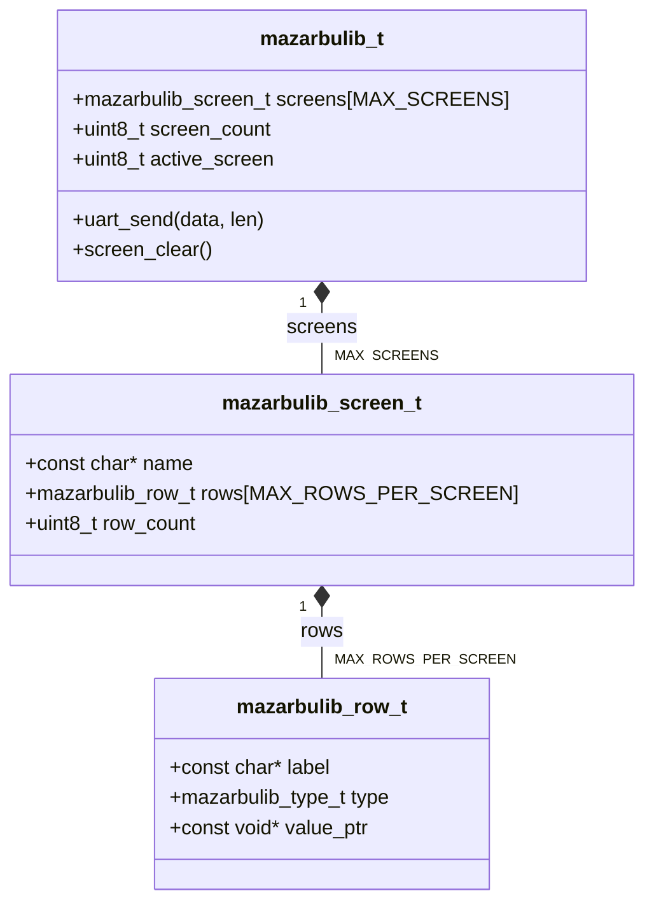
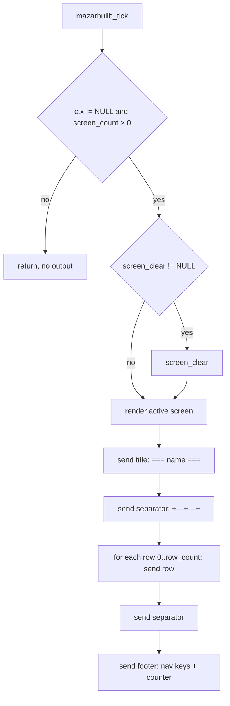
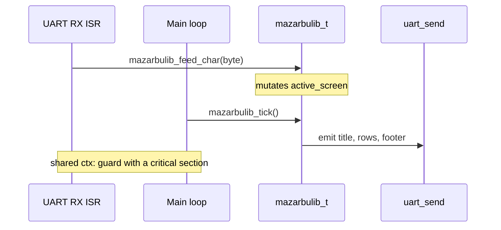

# Architecture

MazarbuLib renders one active screen of labelled values as an ASCII table over
UART. It holds no dynamic state beyond a single caller-owned context struct,
does no allocation, and touches the UART only through a caller-supplied
function pointer. This page covers the data model, the render pipeline, buffer
sizing, and the concurrency model.

## Data model

All state lives in one `mazarbulib_t` context that the application declares
statically. A context owns a fixed array of screens; each screen owns a fixed
array of rows; each row points at a caller-owned value that is read at render
time and never copied.



The array sizes come from `mazarbulib_config.h` (`MAZARBULIB_MAX_SCREENS`,
`MAZARBULIB_MAX_ROWS_PER_SCREEN`) and are fixed at compile time. `screen_count`
and `active_screen` are `uint8_t`, which is why the configured limits may not
exceed 255; see the
[design decisions](design-decisions.md#compile-time-counter-limits).

Rows store only a `const void *` to the value plus a `mazarbulib_type_t` tag.
The pointed-to value is dereferenced during each render, so updating a variable
in place is enough to change what the next tick displays. Nothing is copied and
nothing is owned; see the
[design decisions](design-decisions.md#pull-model-for-values).

## Render pipeline

`mazarbulib_tick` is the only entry point that produces output. It optionally
clears the terminal, then renders the active screen as title, top border, one
line per row, bottom border, and footer.



Each stage formats one line into a stack buffer and hands it to `uart_send`.
The library never buffers a whole frame; it emits line by line as it walks the
active screen.

### Value formatting and alignment

`mazarbulib_format_value_` turns a row's tagged value into text with `snprintf`:
signed and unsigned decimal, `%.2f` for float and double, the string as-is,
`true` / `false` for bool, and `0x%08X` for hex. Numeric and hex values are
right-aligned in the value column; strings and bools are left-aligned. The two
alignment cases use separate format-string literals so the arguments stay
compiler-checkable; see the
[design decisions](design-decisions.md#duplicated-format-literals).

Labels and values are clamped to their column widths with field-width and
precision specifiers, so borders stay aligned regardless of content length.
Over-long content is truncated rather than rejected; see
the [design decisions](design-decisions.md#truncation-over-error).

### Line buffer sizing

Every line is formatted into a stack buffer sized once:

```text
MAZARBULIB_LINE_BUF_SIZE_ = MAZARBULIB_LABEL_WIDTH + MAZARBULIB_VALUE_WIDTH + 16
```

A data row needs `"| " + label + " | " + value + " |\r\n"` plus a NUL, which is
`LABEL_WIDTH + VALUE_WIDTH + 10` bytes. The extra headroom also bounds the title
line, whose screen name is clamped to `MAZARBULIB_TITLE_MAX_LEN_`
(`LINE_BUF_SIZE_ - 12`) so `"=== <name> ===\r\n"` always fits the same buffer.
Because the widths are compile-time constants, no line can overflow, and the
truncated `snprintf` return is clamped before the bytes reach `uart_send`.

## Navigation

Navigation changes `active_screen` only; it produces no output on its own. The
next frame reflects the change when `mazarbulib_tick` runs.

- `mazarbulib_next_screen`: `(active_screen + 1) % screen_count`, wraps to first.
- `mazarbulib_prev_screen`: wraps to last when already at zero.
- `mazarbulib_set_screen`: jumps to an index, no-op if out of range.
- `mazarbulib_feed_char`: maps `MAZARBULIB_NAV_NEXT` / `MAZARBULIB_NAV_PREV`
  bytes to next / prev and ignores everything else.

## Concurrency model

MazarbuLib is single-threaded and holds no locks. The common embedded pattern
feeds received bytes from a UART RX interrupt while the main loop ticks:



`mazarbulib_feed_char` from an ISR and `mazarbulib_tick` from the main loop both
touch the same context. If your platform can interleave them, protect the
context with a critical section appropriate to the target. The library does not
do this for you; see the
[design decisions](design-decisions.md#function-pointer-uart-abstraction) for
why platform concerns stay on the caller's side.
